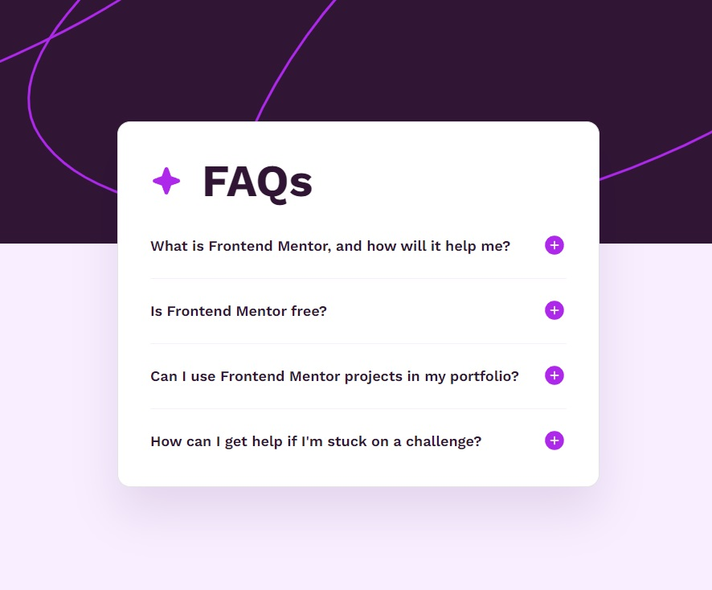

# Frontend Mentor - FAQ accordion solution

This is a solution to the [FAQ accordion challenge on Frontend Mentor](https://www.frontendmentor.io/challenges/faq-accordion-wyfFdeBwBz). Frontend Mentor challenges help you improve your coding skills by building realistic projects. 

## Table of contents

- [Overview](#overview)
  - [The challenge](#the-challenge)
  - [Screenshot](#screenshot)
  - [Links](#links)
- [My process](#my-process)
  - [Built with](#built-with)
  - [What I learned](#what-i-learned)
  - [Continued development](#continued-development)
  - [Useful resources](#useful-resources)
- [Author](#author)

## Overview

### The challenge

Users should be able to:

- Hide/Show the answer to a question when the question is clicked
- Navigate the questions and hide/show answers using keyboard navigation alone
- View the optimal layout for the interface depending on their device's screen size
- See hover and focus states for all interactive elements on the page

### Screenshot



### Links

- Solution URL: [repo](https://github.com/Illia-L/faq-accordion-main)
- Live Site URL: [website](https://illia-l.github.io/faq-accordion-main/)

## My process

### Built with

- HTML5
- CSS
- icons sprite
- Mobile-first workflow

### What I learned

Practiced pseudo classes and pseudo elements:

```css
.faqs-item:not(:last-child) {
  margin-bottom: 20px;
}

.faqs-item:not(:last-child)::after {
  content: '';
  display: block;
  margin-top: 20px;
  height: 1px;
  background-color: #f8eeff;
}
```
Loaded icons via sprite:

```html
<!-- file icons.svg -->
<svg xmlns="http://www.w3.org/2000/svg" aria-hidden="true" style="position:absolute;width:0;height:0;overflow:hidden">
  <defs>
    <symbol id="icon-minus" viewBox="0 0 31 32">
      <path d="M15.484 3.42C8.537 3.421 2.905 9.053 2.905 16s5.632 12.58 12.58 12.58 12.58-5.632 12.58-12.58c-.007-6.946-5.636-12.574-12.58-12.581h-.001zm4.839 13.547h-9.677a.97.97 0 0 1-.002-1.936h9.678a.968.968 0 0 1 0 1.936z"/>
    </symbol>

    <symbol id="icon-plus" viewBox="0 0 31 32">
      <path fill="#ad28eb" d="M15.484 3.42C8.537 3.421 2.905 9.053 2.905 16s5.632 12.58 12.58 12.58 12.58-5.632 12.58-12.58c-.009-6.945-5.636-12.572-12.58-12.581h-.001zm4.839 13.547h-3.871v3.871a.968.968 0 1 1-1.936 0v-3.871h-3.871a.97.97 0 0 1-.002-1.936H14.516V11.16a.968.968 0 0 1 1.936 0v3.871h3.871a.968.968 0 0 1 0 1.936z" style="fill:var(--color1, #ad28eb)"/>
    </symbol>

    <symbol id="icon-star" viewBox="0 0 31 32">
      <path fill="#ad28eb" d="M29.268 16v.015c0 .832-.528 1.541-1.267 1.81l-.013.004-7.737 2.813-2.812 7.735a1.952 1.952 0 0 1-3.654.014l-.004-.013-2.813-7.744-7.735-2.804a1.952 1.952 0 0 1-.014-3.654l.013-.004 7.743-2.813 2.805-7.735a1.952 1.952 0 0 1 3.654-.014l.004.013 2.813 7.743 7.735 2.805a1.93 1.93 0 0 1 1.281 1.814v.016V16z" style="fill:var(--color1, #ad28eb)"/>
    </symbol>
  </defs>
</svg>

<!-- using icons in html -->
<svg
  class="faqs-icon-close"
  width="30"
  height="30"
>
  <use href="./assets/images/icons.svg#icon-minus"></use>
</svg>
```

### Continued development

Going to practice CSS and JS further.

### Useful resources

- [Smooth collapsing](https://codepen.io/brundolf/pen/dvoGyw) - Used this code a bit bodified.
- [Creating icon sprite](https://icomoon.io/) - Creating icon sprite.

## Author

Illia Liashko
